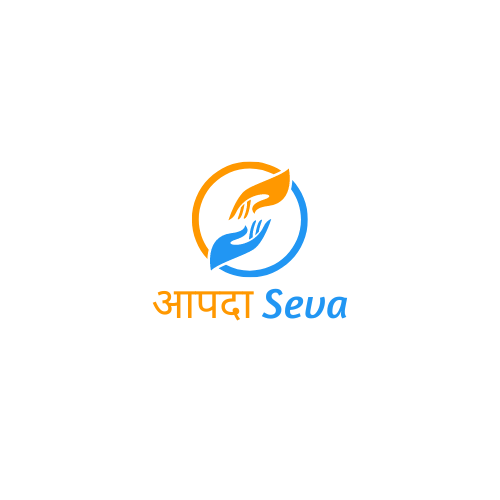

<!-- 

 -->

## About AapdaSeva

The solution consists of a centralized database and a mobile app featuring two portals: Agency and
User. Agencies register, providing essential details like contact information, location, specialization
and availability. Agencies can alert other agencies for assistance and collaborate via chat or call to
better manage the emergency situation. Users seeking help can send requests to agencies based on
disaster type, proximity and availability. An optional feature allows users to upload disaster pictures
to help agencies assess the scale of the situation. The help request also includes the user's current
location for easier reach. Even without internet access, help requests can be sent via call or SMS to a
preset emergency number, connecting users to relevant agencies. Both portals include a map
displaying nearby agencies, filtered by specialization and availability. Users can also opt to donate or
volunteer.

## Documentation

You can find all the documentation [in the wiki](https://github.com/Akharade1809/Aapda_Seva.git).

<!-- ## License
The RescueApp is an open-source software licensed under the [GPL v3 license](https://opensource.org/licenses/GPL-3.0). -->

## Contributors

Thanks goes to these wonderful people:

<!-- ALL-CONTRIBUTORS-LIST:START - Do not remove or modify this section -->
<!-- prettier-ignore-start -->
<!-- markdownlint-disable -->
<table>
  <tbody>
    <tr>
      <td align="center" valign="top" width="20%"> 
      <b>Arjun Kharade</title="Ideas,Planning,&Feedback"></b></td>  <a href="www.linkedin.com/in/arjun-kharade-526577229">LinkedIn</a> 
      <td align="center" valign="top" width="20%"><a href="https://github.com/co00co"> <b>Bhoomi Jain</b></a> <a href="#ideas-co00co" title="Ideas, Planning, & Feedback">🤔</a> <a href="https://github.com/eduayme/RescueApp/commits?author=co00co" title="Documentation">📖</a> <a href="https://github.com/eduayme/RescueApp/issues?q=author%3Aco00co" title="Bug reports">🐛</a> <a href="https://github.com/eduayme/RescueApp/commits?author=co00co" title="Code">💻</a></td>
      <td align="center" valign="top" width="20%"><a href="https://github.com/EnricSalaPujolar"> <b>Anmol Gupta</b></a> <a href="#ideas-EnricSalaPujolar" title="Ideas, Planning, & Feedback">🤔</a> <a href="https://github.com/eduayme/RescueApp/commits?author=EnricSalaPujolar" title="Documentation">📖</a> <a href="#design-EnricSalaPujolar" title="Design">🎨</a></td>
      <td align="center" valign="top" width="20%"><a href="https://joelibaceta.github.io"> <b>Sujal Jain</b></a> <a href="#translation-joelibaceta" title="Translation">🌍</a></td>
      <td align="center" valign="top" width="20%"><a href="https://github.com/rferromoreno"> <b>Priyanka Murthy</b></a> <a href="#translation-rferromoreno" title="Translation">🌍</a></td>
      <td align="center" valign="top" width="20%"><a href="https://github.com/rferromoreno"> <b>R Sai Manasa</b></a> <a href="#translation-rferromoreno" title="Translation">🌍</a></td>
    </tr>
    
  </tbody>
</table>

<!-- markdownlint-restore -->
<!-- prettier-ignore-end -->

<!-- ALL-CONTRIBUTORS-LIST:END -->

This project follows the [all-contributors](https://github.com/all-contributors/all-contributors) specification. Contributions of any kind welcome!
